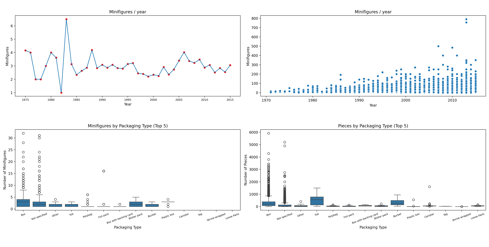
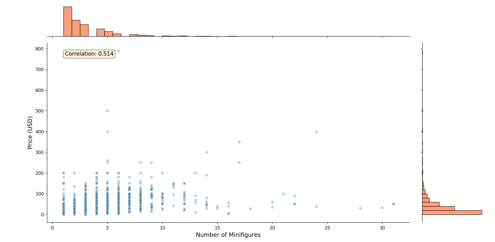
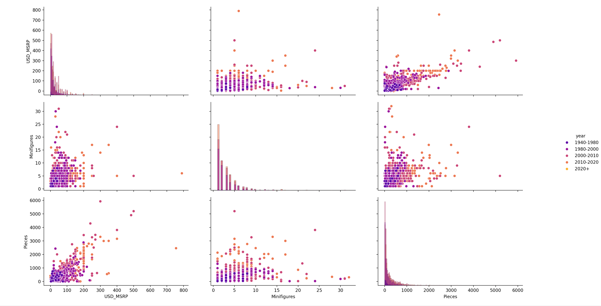
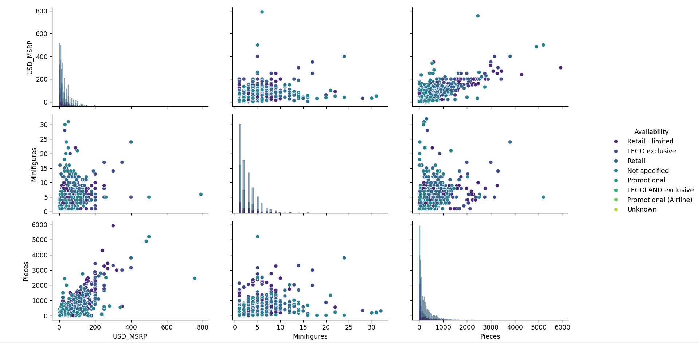

# Lego Dataset Analysis

This project contains data analysis and visualization exercises using a LEGO sets dataset. The analysis explores relationships between various LEGO set attributes such as price, number of pieces, minifigures, packaging types, and release years.

## Dataset

The `legosets.csv` file contains information about LEGO sets including:

- Item_Number: Unique identifier for each set
- Name: Set name
- Year: Release year
- Theme & Subtheme: Product categories
- Pieces: Number of pieces in the set
- Minifigures: Number of minifigures included
- Pricing: GBP_MSRP, USD_MSRP, CAD_MSRP, EUR_MSRP
- Packaging: Type of packaging
- Availability: Retail availability status

## Exercise Questions

The analysis addresses the following questions using appropriate visualizations:

1. **Has the number of minifigures included in the set increased each year?**

   - Does your observation hold for the median as well?
   - Are there outliers?

2. **How does the price in USD relate to the number of minifigures?**

   - What do the marginal distributions look like?

3. **Consider the Pairplot:**

   - What can you do to adjust the diagonal plots?
   - Play around with it and try to use different methods!

4. **Does the variable Packaging have an influence on the number of figures or pieces?**
   - Consider the five most common packaging types excluding the unknown type.

## Files

### Exercise1and4.py



Combines two analyses in a 2x2 subplot layout examining temporal trends and packaging influences.

**Exercise 1: Minifigures Trend Over Time**

**Key Features:**

- Lineplot showing all minifigures data points across years
- Red scatter points overlaid showing yearly mean values
- Analyzes whether minifigures per set have increased over time
- Helps identify trends, outliers, and whether the median follows the same pattern

**Visualization Approach:**

- Uses `sns.lineplot()` to show the overall trend and distribution
- Overlays `sns.scatterplot()` with yearly means for easier trend identification
- Allows visual identification of outliers (data points far from the trend line)

**Exercise 4: Packaging Influence on Set Characteristics**

**Key Features:**

- Analyzes the top 5 most common packaging types
- Two boxplots comparing:
  - Number of Minifigures by Packaging Type
  - Number of Pieces by Packaging Type
- Boxplots reveal median, quartiles, and outliers for each packaging type

**Visualization Approach:**

- Uses `sns.boxplot()` to show distribution comparisons
- Box shows median (center line), Q1 and Q3 (box edges), and outliers (individual points)
- Rotated x-axis labels for better readability

**Key Findings:**

- Exercise 1: Visual inspection reveals trends in minifigure counts over the years
- Exercise 4: Different packaging types show varying distributions of minifigures and pieces
- Boxplots effectively highlight whether packaging type influences set size and complexity

### Exercise2.py



Analyzes the relationship between price and number of minifigures.

**Key Features:**

- Calculates correlation between Minifigures and USD_MSRP
- Creates a joint plot showing:
  - Scatter plot of Price vs Minifigures
  - Marginal distributions (histograms) for both variables
- Displays basic statistics

**Key Findings:**

- Correlation: 0.514 (moderate positive correlation)
- Most LEGO sets contain 0-5 minifigures
- Most sets are priced between 0-50 USD
- Both distributions are right-skewed (long tail towards higher values)

### Exercise3.py



#### Analyzes multiple variables: USD_MSRP, Minifigures, Pieces and Year_Range as Hue (Color Coding)



#### Analyzes multiple variables: USD_MSRP, Minifigures, Pieces and Availability as Hue (Color Coding)

Creates a pairplot to explore relationships between multiple variables.

**Key Features:**

- Analyzes multiple variables: USD_MSRP, Minifigures, Pieces and Year_Range as Hue (Color Coding)
- Also one with USD_MSRP, Minifigures, Pieces and Availability as Hue (Color Coding)
- Shows diagonal plots with histograms
- Shows off-diagonal plots with scatter plots

**Visualization:**
**Visualization:**

- PairGrid with custom diagonal (histplot) and off-diagonal (scatterplot) mappings
- Plasma color palette for year ranges

## Requirements

```
pandas
matplotlib
seaborn
```

Install dependencies:

```bash
pip install pandas matplotlib seaborn
```

## Usage

Run each exercise file individually:

```bash
python Exercise1and4.py
```

```bash
python Exercise2.py
```

```bash
python Exercise3.py
```

Each script will display the corresponding visualizations in separate windows.

## Analysis Insights

### Temporal Trends in Minifigures (Exercise 1)

- The lineplot with overlaid mean values allows visual assessment of whether minifigures per set have increased over time
- Outliers are easily identifiable as data points significantly above the trend line
- Comparing the overall distribution to the yearly means helps determine if the median follows the same trend
- Visual analysis can reveal periods of rapid change or stability in minifigure counts

### Packaging Influence (Exercise 4)

- Boxplots effectively compare distributions across the top 5 packaging types
- Different packaging types show distinct distributions for both minifigures and pieces
- The median (center line) and quartiles (box edges) reveal whether certain packaging types are associated with larger or smaller sets
- Outliers in the boxplots indicate exceptional sets that deviate from typical patterns for their packaging type
- This analysis helps determine if packaging is merely a consequence of set size or if it has an independent influence

### Price vs Minifigures (Exercise 2)

- There is a moderate positive correlation (0.514) between the number of minifigures and price
- The relationship is not perfectly linear, suggesting other factors influence pricing
- Both variables show right-skewed distributions, indicating most sets are at the lower end with some premium outliers

### Multivariate Relationships (Exercise 3)

- The pairplot allows exploration of relationships between four key variables
- Year_Range coloring helps identify temporal trends
- Diagonal histograms show the distribution of each individual variable
- Off-diagonal scatter plots reveal pairwise relationships

## Notes

- The dataset contains some NA values which are handled by dropping them in the analysis
- Visualizations use Seaborn's built-in styling for consistent and professional appearance
- Color palettes (steelblue, coral, plasma) are chosen for clear visual distinction
